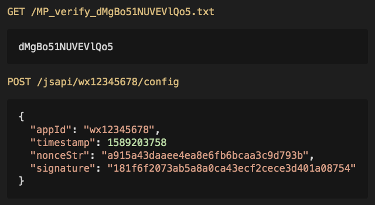

# jsdkd

一个小巧有用的微信公众号应用服务器 + AccessToken缓存服务器



## 主要功能

- [x] Docker镜像秒启.
- [x] 允许多个微信公众号.
- [x] js接口安全域名验证(MP_verify_***.txt 文件请求).
- [x] 获取jssdk接口配置数据(wx.config函数的参数).
- [x] 多种缓存策略(file/memo/redis).
- [x] 查询缓存的access_token和jsapi_ticket.
- [ ] 网页登录授权跳转.

## RESTful路由

- `GET /ping`

> 简单应答服务器当前时间戳, 可用于服务器健康检查.

```
> GET /ping

< HTTP/1.1 200 OK
< Content-Type: application/json; charset=utf-8

{
  "pong": 1589353732719
}
```

- `GET /MP_verify_*.txt`

> 响应来自微信服务器的js接口安全域名验证请求.

```
> GET /MP_verify_dBGMo51NUVEVlQo5.txt

< HTTP/1.1 200 OK
< Content-Type: text.plain; charset=utf-8

dBGMo51NUVEVlQo5
```

- `POST /jsapi/:appid/config`

> 获取wx.config接口数据.

```
> POST /jsapi/wx12345678/config
> Content-Type: application/json

{
  "url": "http://example.com",
  "jsApiList": ["updateTimelineShareData"],
  "any": "echo any"
}

< HTTP/1.1 200 OK
< Content-Type: application/json; charset=utf-8

{
  "appId": "wx12345678",
  "timestamp": 1589203758
  "nonceStr": "a915a43daaee4ea8e6fb6bcaa3c9d793b",
  "signature": "181f6f2073ab5a8a0ca43ecf2cece3d401a08754"
  "url": "http://example.com",
  "jsApiList": ["updateTimelineShareData"],
  "any": "echo any"
}
```

> 请求参数:

- appid: 公众号AppId

- `GET /jsapi/:appid/query?[key=]&realm=&nonce=&ts=&sign=`

> 查询access_token和jsapi_ticket, **必须对请求进行签名验证**.

```
> GET /jsapi/wx12345678/query?key=token&realm=R123&nonce=caa3c9d793b&ts=1589203758&sign=6f3c945fc7a738c1ec80efc8a97187e0

< HTTP/1.1 200 OK
< Content-Type: application/json; charset=utf-8

{
  "key": "token",
  "value": "token value"
}
```

> 请求参数:

- appid: 公众号AppId
- key: 可选, 指定要查询的key, 有效值为:`token` or `ticket`, 默认为`token`
- realm: config文件中定义的外部应用key
- nonce: 随机字符串
- ts: Unix时间戳(ms), 注意: 与服务器的时间差不能超过5分钟
- sign: 请求签名

> 签名算法:

- 待签名字符串(payload)拼接规则: `realm=REALM_KEY&nonce=RANDOM_STRING&ts=UNIX_TIMESTAMP.REALM_SECRET`
- 签名=md5(payload)

`md5(realm=R123&nonce=caa3c9d793b&ts=1589203758.realm_secret) === 782ab722a4efaecade8d3bba953f9c5d`

## 配置文件结构

```js
{
  //可选, 跨域白名单
  cors: [
    "example\\.com"
  ],

  //可选, 缓存配置
  cache: {
    file: 'cache_file.json'
  },

  //可选, 配置允许进行查询的第三方应用
  realms: {
    {key: "realm key", secret: "realm secret"}
  },

  // 公众号应用密钥
  apps: [
    {key: 'app ID', secret: 'app secret'}
  ]
}
```

- `[cors]`

> 可选, 为空或者包含星号(*)时, 被解释为允许任意origin, 否则按照正则表达式逐项匹配(ignore case). 特别地, 私有和保留IP均视为允许的origin, 示例如下:

```js
// 忽略大小写匹配 example.com
'Example\.com'

// 不是完整的http origin, 不匹配
'^example.com'
```

- `[cache]`

> 可选, 默认使用本地memo缓存, 目前支持本地缓存和redis缓存.

```js
cache: {
  file: '缓存文件的绝对路径',
  memo: {}, // 使用memo缓存时, 可以使用初始状态
  redis: 'any options pass to redis nodejs client sdk'
}
```

缓存在初始化时会从cache配置节中**仅选取一个**, 换句话说, 你同时只能配置一种缓存策略. 缓存对象的key的命名方式为: `APP_KEY.[token|ticket]`, 例如:

```sh
127.0.0.1:6379> KEYS *
1) "wx123456789.ticket"
2) "wx123456789.token"
127.0.0.1:6379> 
```

- `[realms]`

> 可选, 定义从外部进行数据查询的应用, 这些外部应用可以通过发送带签名的请求来查询如access_token和jsapi_ticket, 每个应用的格式为: `{key: 'string', secret: 'string'}`.

- `apps`

> 微信公众号应用, 格式为: `{key: 'string', secret: 'string'}`.

### config.json 模板

```js
{
  "cors": [
    "example\.com"
  ],
  "cache": {
    "redis": "redis://localhost:6379"
  },
  "realms": [
    {
      "key": "realm Id",
      "secret": "realm Secret"
    }
  ],
  "apps": [
    {
      "key": "App Id",
      "secret": "App Secret"
    }
  ]
}
```

### 最简单的config.json
```js
{
  "apps": [
    {
      "key": "App Id",
      "secret": "App Secret"
    }
  ]
}
```

## 配置文件的位置

> 服务器按照以下顺序查找配置文件

- `process.env.APP_CONFIG`
- `jsdkd.json` 查找与`src`目录同级的jsdkd.json文件.

## Docker

```sh
docker run -d \
  -p 443:3030 \
  -v ./jsdkd.json:/app/jsdkd.json \
  xixilive/jsdkd
```

see [`Dockerfile`](./Dockerfile)

### Nginx + Docker环境示例

```sh
# start docker container
docker run -d \
  -p 127.0.0.1:3030:3030 \
  -v ./jsdkd.json:/app/jsdkd.json \
  --name jsdkd \
  xixilive/jsdkd
```

```nginx
# nginx.conf

server {
    listen 443 ssl; 
    server_name example.com;

    location ^~ /MP_verify_ {
        proxy_pass http://127.0.0.1:3030/;
    }

    location /jsapi/ {
        proxy_pass http://127.0.0.1:3030/;
    }
}
```

**微信公众号: 前栈笔记**